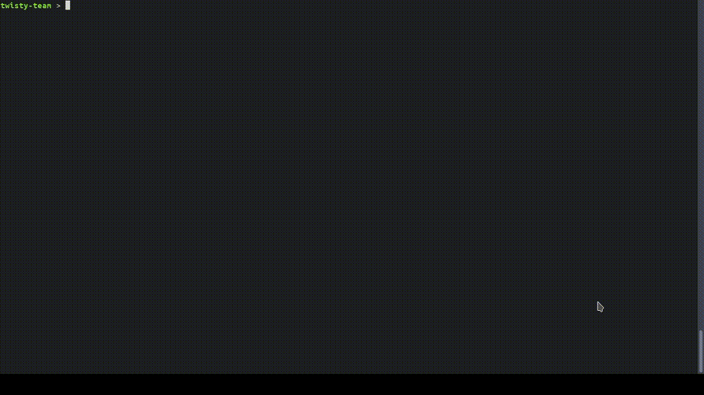

# 🤔 ankamantatra
**Techzara WCC2 final week**

A simple CLI quizz game.

The name *ankamantatra* is a malagasy word that means *riddle*.

The user can play within a specific category or mix them all.
A game session consists of 4 questions, each of different type.
A the end of a session, the user is prompted whether he wants to play again or not.



## ⚒️ Installation
To install from [pypi](https://pypi.org/project/ankamantatra/), type in the terminal:
```sh
pip install ankamantatra
```
Or you can clone this repository and install it manually using [poetry](https://python-poetry.org/),  a tool for dependency management and packaging in Python, by following the following steps :
```sh
git clone https://github.com/twisty-team/ankamantatra.git
```
```sh
pip install poetry
```
```sh
# in the project root directory
poetry build && poetry install
```
In some cases you may get a `KeyringLocked` error that you can bypass by typing :
```sh
export PYTHON_KEYRING_BACKEND=keyring.backends.null.Keyring
```
## 🏃 How to run
If you installed the package with pip, you can run the game by typing in the terminal :
```sh
ankamantatra
```
If you installed it manually using poetry, you can run the game by typing :
```sh
poetry run python -m ankamantatra
```
## ▶ Usage
```
Usage: ankamantatra [OPTIONS] COMMAND [ARGS]...

  A simple quizz game CLI

Options:
  --version  Show the version and exit.
  --help     Show this message and exit.

Commands:
  list  List all available questions to play with.
  play  Use to play quiz game

```

```
Usage: python -m ankamantatra play [OPTIONS]

  Use to play quiz game

Options:
  -c, --categorie TEXT  Specify Quiz categorie
  --help                Show this message and exit.
```

```
Usage: python -m ankamantatra list [OPTIONS]

  List all available questions to play with.

Options:
  -c, --category TEXT   Filter by TEXT
  -sa, --show-answer
  -sc, --show-category
  --category-only       Show only the categories and hide questions
  --help                Show this message and exit.
```

## 🚀 Features
- Play quizz
- List questions or categories

## Authors

* [tbgracy](https://github.com/tbgracy)

* [rhja](https://github.com/radoheritiana)
